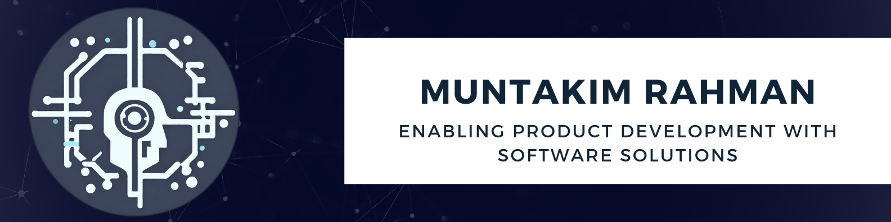

# Hello! Welcome to my GitHub! 🙋🏽‍♂️

<!-- **Dipto9999/dipto9999** is a ✨ _special_ ✨ repository because its `README.md` (this file) appears on your GitHub profile. -->

    
    
    
    
    
    

    
    
    
    
    

## About Me

My name is Muntakim. I'm passionate about creating innovative solutions that combine hardware and software. My experiences lie in data science and embedded systems, and I love working on projects that leverage the intersection of these fields.

### Experience and Education

- 🔋 Currently working as a **Software Applications Engineering Intern** at [TESLA Inc](https://www.tesla.com/en_eu/megapack).
- 🌐 Previously worked as a **Product Coordinator Intern** at [GEOTAB Inc](https://www.geotab.com/).
- 🛰️ Contributed as a **Satellite Firmware Developer** on the [ALEASAT Project](https://www.ubcorbit.com/).
- ⚡ Pursuing a degree in **Electrical Engineering** at the [University of British Columbia](https://you.ubc.ca/ubc_programs/electrical-engineering-vancouver/).

## Ongoing Projects ⏳

- ↻ [**Stock Portfolio**](https://github.com/Dipto9999/Stock_Price_Correlations)
- ↻ [**Electrical Company**](https://github.com/Dipto9999/Electrical_Company)

## Interests and Hobbies ✨

- 📈 **Stock Investing**
- 🏋️‍♂️ **Strength Training**
- ⚽ **Soccer**

## Connect with Me 🤝

    
    
    
    
    
    
    

